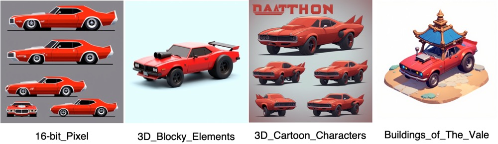
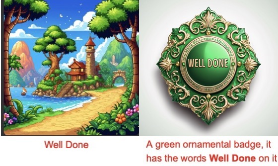
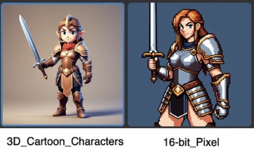

# Prompt guidelines for asset generation

Unity AI Generators transform text prompts into sprite, texture, animation, sound, material, and terrain layer assets. Getting the results you want isn’t just about writing a good prompt, it’s about writing the right prompt for the model you use.

Prompts work differently in image models than in text models, such as ChatGPT.

* Text models are conversational and contextual. They understand abstract requests and can infer meaning.
* Image models, such as Flux 1, are pattern recognizers and assemble visual elements.

Your prompt approach must match the type of model you use.

## Understand the base models and custom-trained models

In Generators, you use a [custom-trained model](#custom-trained-models) that's fine-tuned to achieve a specific style or visual direction in its output. These are based on foundational [base model](#base-models), such as Stable Diffusion XL (SDXL) or Flux 1.

### Base models

Base models provide broad capabilities and can process both short and long prompts. However, to match a specific art style might require multiple iterations. Examples of base models include Flux 1, SDXL, and GPT Image 1.

### Custom-trained models

Custom-trained models are trained to reproduce specific visual styles or elements. Some examples of custom-made models include **16-bit Pixel**, **3D Cartoon Characters**, or **Buildings of The Vale**.

## Key principles for efficient prompting

In Unity AI, the quality of your generated assets depends on both the model selection and how precisely you describe the subject, attributes, and style in your prompt.

Use the following guidelines to choose the right model and describe your ideas effectively, so Unity AI can generate assets that match your intended style, detail, and purpose.

### Same prompt gives different results across models

Unity AI models are style-bound and each model is trained on a different visual aesthetic. The base model stays the same, but each custom-trained model applies its own style. This means the same prompt can produce dramatically different results depending on the custom model you choose.

#### Example

The following example uses the same prompt across four different models. The outputs differ in art direction and level of detail.

**Prompt**: `A designsheet for a 2d sideview, orthogonal red muscle car or dragracer. It has big backwheels and smaller front wheels. An air intake sticks out of the hood of the car.`

| **Model** | **Output description** |
| --------- | ---------------------- |
| **16-bit Pixel** | Retro pixel-art sprite sheet with minimal lighting and hard edges. |
| **3D Blocky Elements** | Cheerful, block-style subjects with a soft 3D appearance. The style provides clean and smooth shapes. |
| **3D Cartoon Characters** | Bold, saturated colors and exaggerated proportions, more cartoon-like. |
| **Buildings of The Vale** | Stylized fantasy structure incorporating a red car into an environmental setting. |

Before you write a prompt, consider the model. For example:

* Use a **16-bit Pixel** model if you want pixel art.
* Use a **3D Blocky Elements** model if you want a toy-like render.
* Use a **3D Cartoon Characters** model if you need bold, cartoon-like proportions.
* Use a **Buildings of The Vale** model if you want a stylized fantasy-environment render.

Even if the prompt is perfect, the model’s trained style will determine the final look.

### Write in visual terms, not abstract concepts

Image models struggle with abstract ideas, such as praise or success. These are vague to interpret and lead to unexpected or irrelevant results. Instead, describe exactly what you want in specific, visual terms.

| **Avoid concepts** | **Use visual description** |
| ------------------ | -------------------------- |
| National monument | A giant stone obelisk outside Washington D.C., surrounded by green lawns. |
| Praise icon | Thumbs-up icon in 2D flat style with yellow circular background. |
| Scary forest | A dense forest at night with twisted trees, glowing red eyes in the shadows, and thick fog. |
| Futuristic city | A city skyline at night with tall neon-lit skyscrapers, flying cars, and glowing billboards in cyberpunk style. |

#### Example

The following example shows why visual descriptions work better than abstract concepts. The prompt `Well Done` (left) is vague, so the model guessed an unrelated scenic image. In contrast, the prompt `A green ornamental badge, it has the words **Well Done** on it` (right) produces a precise, relevant design that matches the request.

**Prompt**: `A green ornamental badge, it has the words "Well Done" on it.`

### Use a simple structure for clarity

Reliable prompts follow a clear, consistent pattern:

`[Subject] + [Attributes] + [Style/context]`

This approach helps you in the following ways:

* Put the main subject first so the model immediately knows what to focus on.
* Add relevant descriptive details without overloading the request.
* Specify the style and setting so the result matches your intended art direction.

#### Example

The following example applies the same prompt to two different models. The **3D Cartoon Characters** model produces a stylized 3D render, and the **16-bit Pixel** model delivers a retro sprite. This shows how the model choice changes the art direction, detail, and style.

**Prompt**: `A young female warrior in leather armor, holding a sword, side-facing, pixel art style.`

### Avoid double negatives

Double negatives can confuse Generators and lead to undesired results. Be direct and positive in your phrases. In the **Negative Prompt** field, don't use `no` or `not.

For example, instead of `No birds`, use `birds`.

You can also use the **Negative Prompt** field to reduce common quality issues. For example, if your output looks blurry or distorted, add terms like blurry, poor quality, or low resolution to the negative prompt.

Some examples of negative prompts include `blurry`, `poor quality`, `low resolution`, or `distorted anatomy`.

These help the model avoid producing low-quality or unwanted elements in the generated asset. For more information on how to use a negative prompt, refer to [Remove unwanted elements with negative prompts](xref:negative-prompt).

## Additional resources

* [Generate sprite with a prompt](xref:generate-sprite)
* [Generate Texture2D asset with a prompt](xref:generate-texture2d)
* [Generate sound asset with a prompt](xref:sound-prompt)
* [Generate material with a prompt](xref:material-generate-prompt)